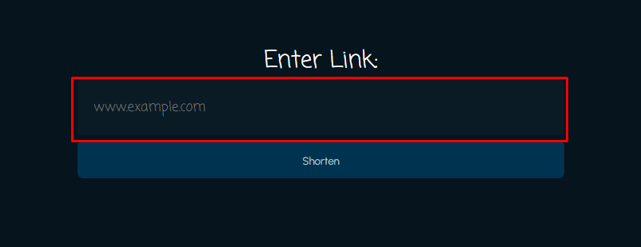

# URL Shortner

Created using Flask and VanillaJS, this clone includes not only english words but has the option to switch to spanish words and food-related words

## Installation

Use the package manager [pip](https://pip.pypa.io/en/stable/) to install the following dependencies

- flask
- flask_wtf
- pymongo

Additionally, create a mongoDB database for the URLs and create a .env file in the root directory with the following variables:
- MONGO_DB_URI
    - copy the connection URI from your mongoDB database.
- DOMAIN
    - your local IP address.
- PORT
    - the port you want to use.
- FLASK_SECRET_KEY
    - the secret key for your flask application.
- PEPPER
    - the pepper string for storing account passwords.

Then, change your directory to the `/URL-Shortener/src` directory. To start, type

```bash
python app.py
```
And you're finished!

## How to Use

To shorten a URL, type in the main textbox and press the `Shorten` button or click hit `Enter`. The shortened URL will be displayed in the same textbox.


To sign in or sign up, press the `Sign In` or `Sign Up` button.
